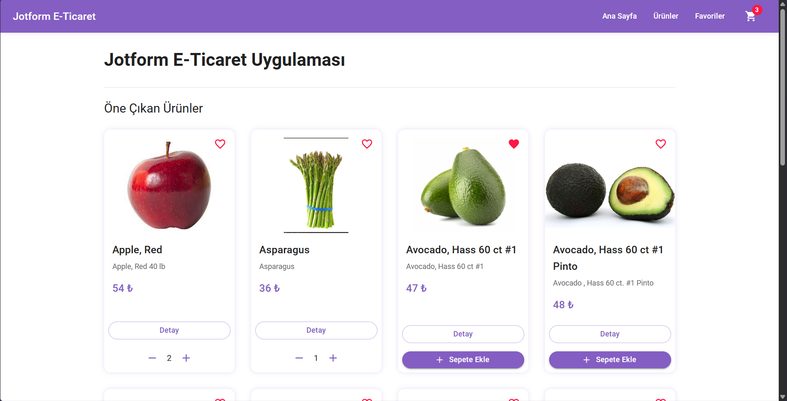
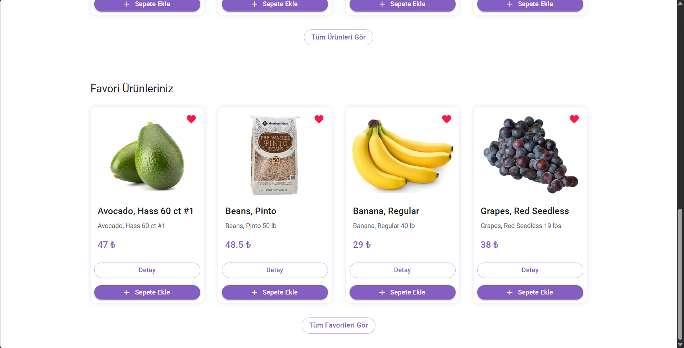
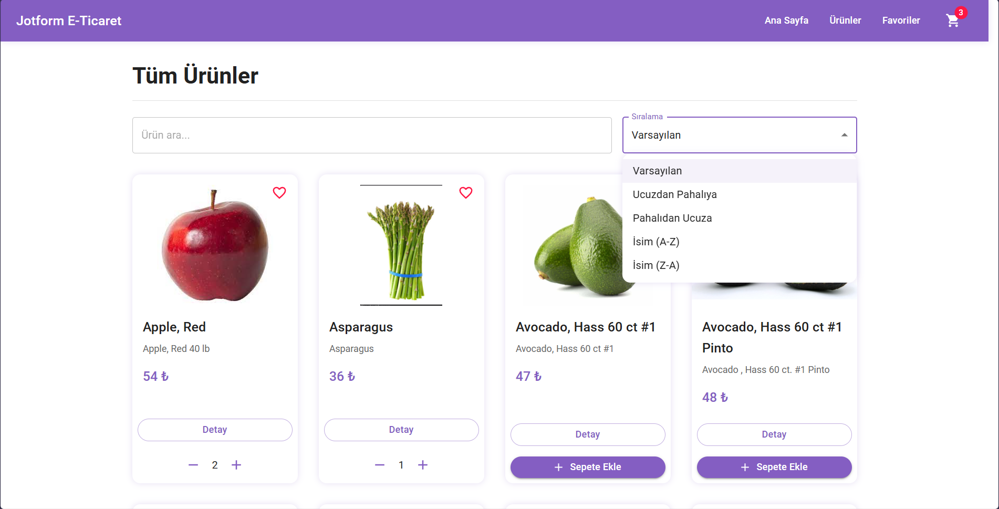
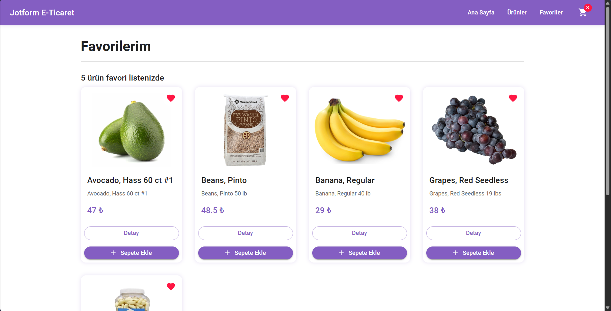
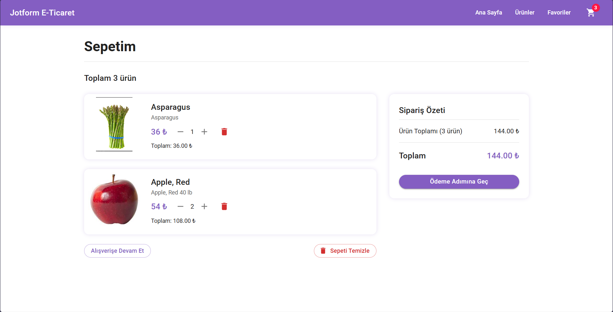
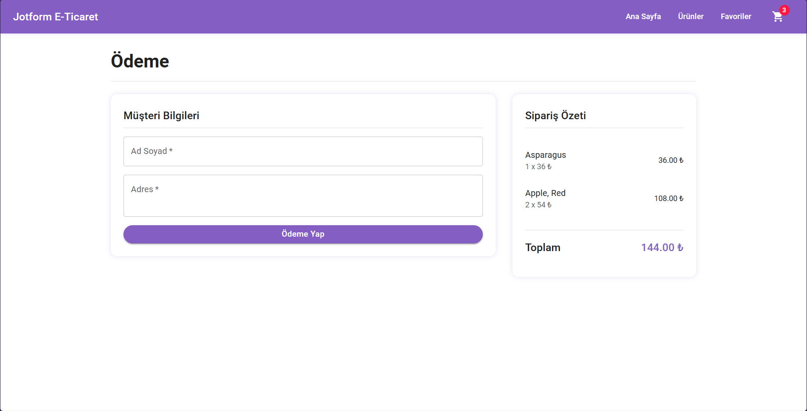

# Jotform Frontend Hackathon Project

## User Information

- **Name**: Sinan Doğan
- **Project Date**: 20.04.2025
- **Hackathon Duration**: 6 hours

## Project Description

A responsive e-commerce platform built with React, TypeScript, and Material UI for the Jotform Frontend Hackathon. Features product browsing, cart management, and checkout functionality with data fetched from Jotform's API.

## Features

### Core Features
- **Product Listing**: Browse all products with images and essential details
- **Product Details**: View comprehensive product information
- **Shopping Cart**: Add, update quantities, and remove products
- **Checkout Process**: Simple user information form and order summary

### Enhanced Features
- **Favorites System**: Add products to favorites and view them (stored in localStorage)
- **Search Functionality**: Find products by name or description
- **Sorting Options**: Sort products by name (A-Z, Z-A) or price (low-high, high-low)
- **Responsive Design**: Optimized for desktop, tablet, and mobile devices
- **Pagination**: Browse products in manageable pages
- **Cart Total**: View cart total cost in real-time
- **Persistant Cart**: Cart items saved in localStorage

## Run Locally

Clone the project

```bash
  git clone https://github.com/sinandgnn/JotformFrontendHackathon-20.04.2025.git
```

Go to the project directory

```bash
  cd JotformFrontendHackathon-20.04.2025
```

Install dependencies

```bash
  npm install
```

Start the server

```bash
  npm run dev
```

The application will be available at http://localhost:5173/

## Project Structure

```
src/
├── api/            # API calls and data handling
├── components/     # Reusable UI components
├── contexts/       # React context for state management
├── pages/          # Main application pages
├── routes/         # Routing configuration
├── types/          # TypeScript type definitions
├── App.tsx         # Main application component
└── main.tsx        # Application entry point
```

## Screenshots

### Home Page
  


### Products


### Favorites


### Cart


### Checkout



## License
This project is licensed under the MIT License - see the [LICENSE](LICENSE) file for details.